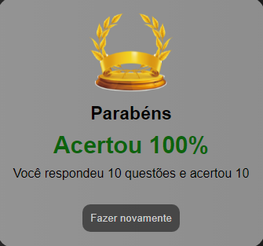
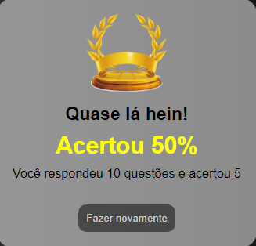
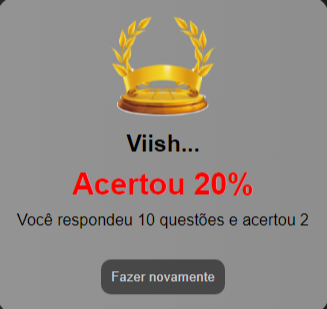

# Complete
 

 

     

 

 
   ## 🚀 Technologies
   
   
   It was used in this project
  - ✔️ Javascript
  - ✔️ HTML
  - ✔️ CSS

 

# About this project
 > - An HTML and CSS structure was made to organize the position of the questions.
 > - A progress bar as you advance the questions has been entered.
 > - Based on a Json structure of information that contains the correct questions and answer, it will be computed at the end of the project.
 > - At the end of this project you will receive your performance according to the number of hits you have obtained.
 
  
 
 # Project Complete 💥
